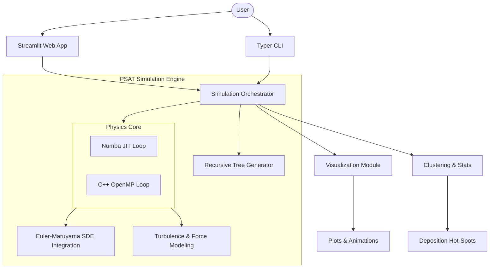

# PSAT — Particle Simulation for Aerosol Transport

[](https://github.com/Ibrahimboutal/PSAT/actions/workflows/tests.yml)
[](https://www.python.org/downloads/)
[](https://opensource.org/licenses/MIT)
[](https://codecov.io/gh/Ibrahimboutal/PSAT)

---

## 🚀 Simulate How Particles Move Inside Human Airways

PSAT is a **high-performance 3D Monte Carlo simulation engine** that models how aerosol particles (e.g. pollutants, pathogens, or drug particles) travel and deposit inside a bifurcating airway.

Built using **stochastic differential equations (SDEs)** and accelerated with **Numba JIT**, it combines scientific accuracy with interactive exploration.

---

## 🎮 Live Demo

Interact with the simulation directly in your browser:

* Adjust particle size, airflow, and physical parameters
* Visualize particle trajectories in real time
* Analyze deposition along airway walls

👉 **Try it live:**
[](https://9wrvkavte4vftxmgxwcnzf.streamlit.app/)

---

## 🏆 Key Highlights

* 🚀 **100–300× speedup** via Numba JIT & Native C++ APIs
* ⚡ **3x Multi-Threaded Acceleration** via OpenMP & Numba Prange
* 🧠 Implements **Euler–Maruyama stochastic integration**
* 🌬️ Models real forces: diffusion, gravity, thermophoresis, electrostatics
* 🌳 **Multi-Generation Airway Tree** (Weibel Model support)
* 🌪️ **Bifurcation-Induced Turbulence** (Reynolds-dependent eddy diffusivity)
* 🌐 **Interactive Streamlit UI + CLI**
* 📊 Real-time trajectory & deposition visualization
* 🧪 CI/CD with testing, linting, and coverage

---

## 🌍 Why This Matters

Understanding aerosol transport is critical for:

* 🦠 Respiratory disease modeling (airborne transmission)
* 🌫️ Air pollution exposure analysis
* 💊 Inhaled drug delivery systems

PSAT provides a **fast, interactive alternative** to expensive experimental setups.

---

## 🧩 System Architecture



---

## ✨ Features

| Feature                   | Details                                                                       |
| ------------------------- | ----------------------------------------------------------------------------- |
| **Physics model**         | 3D Euler-Maruyama SDE with diffusion, gravity, thermophoresis, electrostatics |
| **Particle distribution** | Polydisperse log-normal distribution                                          |
| **Slip correction**       | Cunningham factor for nano-particles                                          |
| **Airway Geometry**       | **Multi-generation recursive tree (Weibel Model)**                            |
| **Turbulence**           | **Bifurcation-induced Reynolds-dependent eddy diffusivity**                   |
| **Performance**           | Compiled with Numba (LLVM → native code) or C++ OpenMP                        |
| **Interfaces**            | CLI + Streamlit                                                               |
| **CI/CD**                 | GitHub Actions (tests, lint, coverage)                                        |

---

## 🎥 Simulation Preview


---

## 📊 Deposition Analysis


---

## ⚡ Performance

Core simulation loop is natively multi-threaded using OpenMP and Numba:

```python
@numba.njit(fastmath=True, parallel=True)
```

| Metric | Particles | Core Processing Time |
| ------ | --------- | -------------------- |
| Pure Python | 500 | ~100-300x slower |
| C++ Sequential | 100,000 | ~81.6s |
| **C++ OpenMP (8-Cores)** | **100,000** | **~27.6s (300% Boost)** |

> The stochastic Monte Carlo physics calculations are embarrassingly parallel, unlocking near-linear hardware scaling across independent CPU cores.

> One-time JIT cost (~1–3s), then cached.

Run benchmark:

```bash
jupyter notebook benchmark.ipynb
```

---

## 📐 Mathematical Model

### Euler-Maruyama Stochastic Integration

Particle positions evolve according to the Itô SDE:

$$dX = f(X)\,dt + \sqrt{2D}\,dW$$

Discretised using the Euler-Maruyama method:

$$X_{n+1} = X_n + f(X_n)\,\Delta t + \sqrt{2 D \,\Delta t}\;\xi_n, \quad \xi_n \sim \mathcal{N}(0,1)$$

where $f(X)$ is the total deterministic drift (advection + settling + thermophoresis + electrostatics) and $D$ is the particle diffusivity.

### Cunningham Slip Correction Factor

For nano- and sub-micron particles, the continuum assumption breaks down. The
Cunningham factor corrects the Stokes drag:

$$C_c = 1 + Kn\!\left(1.257 + 0.4\,e^{-1.1/Kn}\right), \quad Kn = \frac{2\lambda}{d_p}$$

where $\lambda = 66.4\,\text{nm}$ is the mean free path of air and $d_p$ is the particle diameter.

### Stokes Relaxation Time & Settling Velocity

$$\tau_p = \frac{\rho_p\,d_p^2\,C_c}{18\,\mu}, \qquad v_s = \tau_p\,g$$

### Brownian Diffusivity (Stokes-Einstein)

$$D = \frac{k_B\,T\,C_c}{3\pi\,\mu\,d_p}$$

### Thermophoretic Drift (Brock approximation)

$$\mathbf{v}_{th} \approx -K_{th}\,\nabla T$$

### Electrostatic Drift

$$\mathbf{v}_{E} = Z\,\mathbf{E}, \qquad Z = \frac{q\,e\,C_c}{3\pi\,\mu\,d_p}$$

---

## 🚀 Installation

```bash
git clone https://github.com/Ibrahimboutal/PSAT.git
cd PSAT
pip install -e ".[dev]"
```

---

## 🖥️ Run the Web App

```bash
streamlit run app.py
```

Open: [http://localhost:8501](http://localhost:8501)

---

## 💻 CLI Usage

```bash
psat --num-particles 500

psat --num-particles 300 \
     --mean-diameter 0.5e-6 \
     --geo-std-dev 1.8 \
     --animate

psat --num-particles 1000 \
     --grad-t-x 500 \
     --e-field-y 1000 \
     --q-charges 5
```

---

## 📁 Outputs
All generated artifacts are saved to the `outputs/` directory to keep the root clean.

| File               | Description           |
| ------------------ | --------------------- |
| `results.json`     | Simulation statistics |
| `deposition.png`   | Deposition histogram  |
| `trajectories.png` | Particle paths        |
| `simulation.gif`   | Animation             |

---

## 🧪 Testing & Quality

```bash
pytest tests/ -v --cov=psat
ruff check psat/
```

CI ensures:

* ✅ Physics correctness
* ✅ Code quality
* ✅ Coverage tracking

---

## 🏗️ Project Structure

```
psat/
├── engine.py
├── visualization.py
├── cli.py
├── constants.py
tests/
app.py
benchmark.ipynb
```

---

## 📜 License

MIT — see [LICENSE](LICENSE)
